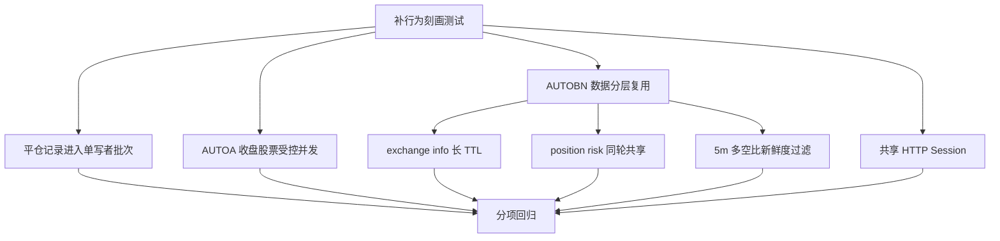

# 自动交易效率优化设计

## 0. 术语约定

- **同轮快照**：一次 `rzq_market` 市场分析调用开始后取得、仅供该轮决策共享的数据；下一轮不复用。
- **交易后确认**：下单或平仓动作完成后，为确认真实仓位重新请求账户仓位；不属于可消除的重复调用。
- **新鲜 5m 多空比**：数据时间戳距当前不超过 5 分钟的最新记录；超过 5 分钟即视为本轮不可用。
- **平仓写入批次**：短时间内进入单写者缓冲区、由一次 Excel 写操作落盘的一组平仓记录。

## 1. 决策与约束

### 需求摘要

保持 AUTOA 和 AUTOBN 的交易判断频率、实时性及结果不变，仅优化数据获取和持久化编排：平仓记录批量写入现有 Excel；AUTOA 收盘涨停池受控并发；AUTOBN 复用低频交易所元数据和同轮仓位快照；5m 多空比只接受 5 分钟内的新鲜数据；两类交易统一复用并关闭 HTTP Session。

成功标准：外部可观察的策略判断、消息内容、平仓记录字段和 sheet 格式不变；相同工作量下 Excel 重写次数、可复用 API 请求和 HTTP 连接创建次数下降；异常仍按标的或数据源隔离。

### 明确不做

- 不实现 AUTOA single-flight。
- 不降低持仓每分钟检查频率。
- 不跨调度轮复用 AUTOA 实时行情。
- 不让已有持仓进入 observation 开仓分支。
- 不删除下单、平仓后的必要仓位确认。
- 不迁移到 SQLite/CSV，不改变既有 Excel 路径、sheet、列名和格式。
- 不使用超过 5 分钟的多空比旧数据兜底。

### 关键决策

1. **先刻画后优化**：每个优化节点先补当前行为测试，再独立改造和验证。
2. **Excel 单写者批量落盘**：调用方提交记录后由唯一写入者合并批次，一次读取和重写工作簿；程序关闭前刷新剩余记录。
3. **AUTOA 只并发不同股票**：收盘涨停池使用现有并发上限；单只失败不取消其他股票，结果更新语义保持不变。
4. **按变化频率分层复用**：exchange info 使用长 TTL；position risk 只在同一分析轮的决策阶段共享；交易动作后重新查询。
5. **5m 数据以新鲜度判定**：每轮获取后选择时间戳距当前不超过 5 分钟的最新记录；没有则视为不可用，不重试、不使用过期缓存。
6. **Session 归应用生命周期管理**：AUTOA 与 AUTOBN 各自复用 Session，正常及异常退出均统一关闭。

复杂度偏离：该任务跨持久化、A 股行情编排、币安数据与资源生命周期，采用分步安全网与独立回滚，不走轻量模式。

## 2. 名词与编排

### 2.1 名词层

#### 现状

- `CloseRecordManager.record_close` 每条记录立即读取并重写所有 Excel sheet（`tokenDemo/autoTrade_pm.py:179-265`）。
- `AUTOBN.get_symbols_info` 接收 exchange info 并生成 `symbols_info`；`_rzq_market_impl` 每 15 分钟重新获取（`tokenDemo/autoTrade_pm.py:2140-2162,2280-2293`）。
- `AUTOBN.get_position_risk` 将远端仓位同步到本地账本（`tokenDemo/autoTrade_pm.py:2164-2239`）。
- `get_long_short_ratio` 缓存 1h 数据，但每次另取一条 5m 数据并直接拼接（`tokenDemo/autoTrade_pm.py:1292-1349`）。
- AUTOA 使用类级共享 Session；AUTOBN 消息每次创建 Session（`tokenDemo/autoTrade_pm.py:635-688,2600-2622`）。

#### 变化

- 平仓记录增加“待写批次”状态，但对调用者仍接受同样的记录字段；示例：同轮 3 笔记录最终仍分别出现在原 sheet，只触发一次工作簿读写。
- exchange info 缓存携带获取时间；TTL 内直接生成或复用 `symbols_info`，过期或缺失时刷新。
- 同一仓位刷新周期的快照只服务该次刷新触发的决策节点；示例：15 分钟刷新点的一轮分析多个 symbol 共用一次快照，但某 symbol 平仓成功后仍重新查询该 symbol。
- 5m 多空比增加新鲜度判定；示例：当前 10:06，最新记录时间为 10:03 时可用，09:59 时不可用且不拼入结果。
- HTTP Session 增加明确的共享与关闭契约；关闭后再次启动可创建新 Session。

### 2.2 编排层

#### 现状

- 平仓调用同步等待完整 Excel I/O。
- AUTOA 收盘循环逐只等待股票行情。
- AUTOBN 在周期入口和部分决策节点分别请求数据，变化频率未明确分层。
- Session 创建和关闭策略在 AUTOA/AUTOBN 间不一致。

#### 变化

- 平仓调用提交到单写者；写入者聚合当前批次后一次更新全部目标 sheet，关闭时强制刷新。
- AUTOA 收盘先取得股票清单，再在既有并发上限内并发获取；结果逐只应用，失败项跳过。
- AUTOBN 保持现有 15 分钟仓位刷新节奏：刷新时取得 exchange info 和 position risk，向该次刷新触发的消费者传递；非刷新分钟不新增仓位请求，交易后确认不读取该快照。
- 多空比继续组合 1h 与 5m，但 5m 仅在新鲜度合格时参与。
- 主程序生命周期负责创建/复用/关闭两类 Session，关闭动作幂等。

#### 流程级约束

- **顺序**：同一 Excel 批次内保持提交顺序；不同 sheet 的既有内容全部保留。
- **并发**：AUTOA 并发数不超过现有 `MAX_CONCURRENT_REQUESTS`；单只异常不取消其他任务。
- **时效**：AUTOA 实时行情每轮重新请求；5m 多空比不得超过 5 分钟。
- **一致性**：决策快照不得用于交易后确认。
- **错误语义**：写入失败必须记录错误且保留尚未成功落盘的批次；Session 关闭可重复调用。
- **可观测性**：日志应能区分缓存命中/刷新、批次记录数和关闭结果，但不改变通知文本。

### 2.3 挂载点清单

1. 平仓记录提交与应用退出刷新：移除后恢复逐笔 Excel 写入。
2. AUTOA 收盘涨停池任务：移除后恢复逐只串行处理。
3. AUTOBN 市场分析的数据上下文：移除后恢复各节点独立请求。
4. AUTOA/AUTOBN 应用启动和退出的 HTTP Session 生命周期：移除后恢复当前连接管理。

### 2.4 推进策略

1. **行为安全网**：固化 Excel 契约、收盘观察更新、API 调用边界、多空比新鲜度输入形态和 Session 生命周期；退出信号是目标路径在不改生产逻辑时测试通过。
2. **平仓持久化**：引入单写者批次并保留现有 Excel 契约；退出信号是多笔记录一次批量落盘且内容、顺序、sheet 不变。
3. **AUTOA 收盘编排**：改为受控并发；退出信号是并发上限、结果集合和单只失败语义均通过测试。
4. **AUTOBN 元数据与仓位快照**：分别落地长 TTL 和同轮共享；退出信号是调用次数下降且交易后确认测试仍发生远端查询。
5. **多空比新鲜度**：过滤超过 5 分钟的 5m 记录；退出信号是边界时间场景符合契约，1h 既有缓存行为不变。
6. **Session 生命周期**：统一共享和幂等关闭；退出信号是重复消息复用连接、退出后 Session 已关闭且可重新初始化。
7. **整体回归**：运行目标测试和项目既有测试；退出信号是全部通过且范围守护无偏离。

### 2.5 结构健康度与微重构

- **compound convention**：未发现目录组织、文件归属或命名约定沉淀。
- **文件级**：`autoTrade_pm.py` 超过 3000 行并混合持久化、两类交易和消息职责，继续追加会加重职责混杂。
- **目录级**：`tokenDemo/` 已承载多类脚本；本次新增主要是测试，不宜借机重组目录。
- **结论：不做前置微重构**。拆文件会显著扩大调用方和生命周期改动面，无法满足“只搬不改行为”的低风险边界。本次仅在现有职责附近做最小改动；模块拆分另走 `cs-refactor`。

## 3. 验收契约

### 关键场景

1. 连续提交多笔 AUTOA/AUTOBN 平仓记录 → 一次批量写入后，各记录按提交顺序出现在原 sheet，其他 sheet 内容不变。
2. Excel 写入失败 → 错误可见，未成功记录不会被静默丢弃；后续刷新可再次尝试。
3. 收盘涨停池含多只股票 → 同时处理数不超过并发上限，最终 observation 与串行语义一致。
4. 某只 A 股行情失败 → 其他股票仍完成 observation 更新。
5. exchange info 在 TTL 内多轮使用 → 只调用一次；过期后下一轮刷新。
6. 到达 AUTOBN 既有 15 分钟刷新点且涉及多个 symbol → 共用该次 position risk；非刷新分钟不新增请求，下一个刷新点重新取得。
7. 下单或平仓完成后确认仓位 → 必须执行新的远端查询，不读取决策快照。
8. 5m 最新记录距当前恰好 5 分钟 → 可用；超过 5 分钟 → 不参与结果且不用旧缓存兜底。
9. 连续发送多条 AUTOA/AUTOBN 消息 → 各自复用共享 Session；应用退出后均关闭。
10. Session 重复关闭或关闭后重新启动 → 不报错，后续可创建新 Session。

### 反向核对项

- AUTOA 持仓仍每分钟检查。
- AUTOA 每轮仍获取最新实时行情。
- 同时存在于 observation 和 positions 的代码只走持仓分支。
- 不存在 AUTOA single-flight 或跨轮实时行情缓存。
- 交易后必要仓位确认请求仍存在。
- Excel 路径、sheet 名、列名、字段格式和通知文本不变。
- 不新增 SQLite、CSV 或第三方依赖。

## 4. 领域影响

本次不新增用户可感能力，属于内部性能与资源生命周期优化，不需要 requirement。新增“同轮快照”和“平仓写入批次”仅为内部编排术语，不进入领域 CONTEXT。缓存层级与交易后确认边界是稳定流程约束，但限定在当前脚本内部，暂不形成跨项目 ADR。
