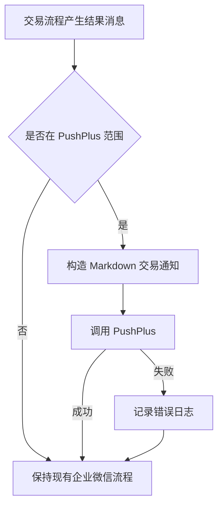

# PushPlus 交易通知设计

## 0. 目标

为真实交易结果提供适合移动端阅读的 Markdown 通知。AUTOBN 覆盖成功开仓、成功平仓及交易动作失败；AUTOA 仅覆盖包含 N 策略的成功开仓和平仓。用户已确认 Markdown 格式和“仅交易动作失败”的告警边界。

## 1. 决策与约束

- PushPlus 使用 Markdown：比纯文本有更清晰的标题、字段重点和分隔，比 HTML 更少兼容与维护成本。
- PushPlus 使用独立展示模型，不修改现有企业微信正文和发送范围。
- 标题格式为“状态 + 市场 + 动作 + 标的”，正文按“标的/策略 → 成交或失败信息 → 风控或结果”分层。
- PushPlus token 只从运行环境读取，不写入代码或项目配置。
- PushPlus 失败只记录日志，不中断交易、持仓更新、Excel 记录或企业微信通知。
- AUTOA 的 N 过滤依据结构化策略列表，不解析消息字符串。
- 走内部通知增强默认复杂度档位，无高并发、对外 SDK 或新依赖偏离。

### 明确不做

- 不推送每日持仓汇总、观察信号、行情异常、扫描超时和一般系统日志。
- 不改变开仓、平仓、止盈止损、持仓序列化和企业微信行为。
- 不引入 HTML 模板、第三方依赖、持久化队列或重试系统。

## 2. 方案

### 2.1 名词层

**现状**：交易流程直接拼接企业微信纯文本正文；共享 `PositionSide` 和 `format_strategy_tags` 提供结构化策略及展示标签。PushPlus 初版只接受标题和原始正文，使用 `txt` 模板。

**变化**：引入轻量的“交易通知”值对象，输入包含市场、动作、状态、标的、策略和有序字段，输出 PushPlus 标题与 Markdown 正文。示例：

- 输入：`AUTOBN / 开仓 / 成功 / BTCUSDT / [N] / 成交价、数量、杠杆`
- 标题：`✅ AUTOBN 开仓 · BTCUSDT`
- 正文：一级标题展示动作，标的和策略置顶，交易字段以 Markdown 列表展示。

失败通知只需要市场、动作、标的、原因和时间；AUTOA 通知资格由策略列表中是否包含 `N` 决定。

### 2.2 编排层

**现状**：AUTOBN 的 `send_msg` 同时承担企业微信路由与日志；AUTOA 的 `send_msg` 统一发送企业微信，交易调用点和一般通知调用点共用入口。

**变化**：交易调用点显式提供交易通知上下文；统一格式化节点生成 Markdown，再由统一 PushPlus 发送节点发送。AUTOBN 成功开平仓及现有明确交易失败/跳过消息进入该节点；AUTOA 只有 N 策略成功开平仓进入。发送顺序不构成交易成功条件，任何 PushPlus 异常在通道边界被吞并并记录。

流程级约束：

- 同一交易动作每次执行最多触发一次 PushPlus。
- AUTOA 策略不含 N 时不得调用 PushPlus。
- token 缺失视为通道未启用，静默跳过。
- HTTP 非 200 或业务 code 非 200 记录可定位的错误，不泄露 token。

### 2.3 挂载点

- PushPlus 环境凭证：移除后通道整体停用。
- 统一 Markdown 交易通知格式化器：移除后失去结构化展示。
- AUTOBN 交易结果挂载：移除后币安交易不再推送。
- AUTOA N 策略交易结果挂载：移除后 A 股目标交易不再推送。
- PushPlus HTTP 发送节点：移除后不再连接外部通道。

### 2.4 推进策略

1. 建立交易通知值对象与 Markdown 输出，固定成功/失败示例。
2. 接通统一 PushPlus 发送节点，验证 token 缺失、成功和失败语义。
3. 接入 AUTOBN 成功及交易动作失败路径，确认不扩大到系统异常。
4. 接入 AUTOA N 策略成功开平仓，验证非 N 被过滤。
5. 回归企业微信和交易流程，并进行一次真实 Markdown 推送。

### 2.5 结构健康度与微重构

`tokenDemo/autoTrade_pm.py` 超过 3400 行且混合交易、行情、持久化和通知职责，继续加入格式化细节会加重胖文件问题。`tokenDemo/` 根目录也已有多种脚本，但新增一个职责明确的通知模块不会造成新的目录层级混乱。

本次做最小微重构：把 PushPlus 请求、交易通知值对象和 Markdown 格式化放入独立通知模块；原交易文件只保留调用与业务筛选。验证方式是导入/单元测试持续通过，交易算法及原企业微信正文无变化。更大范围拆分 `autoTrade_pm.py` 属于结构性重构，建议后续另走 `cs-refactor`，不阻塞本功能。

## 3. 验收契约

1. 配置有效 token 并触发 AUTOBN 成功开仓或平仓 → 收到标题含市场、动作、标的的 Markdown 消息，正文展示策略及现有交易字段。
2. AUTOBN 明确开仓失败、平仓失败或因持仓查询异常跳过 → 收到失败标题、原因和时间；一般扫描/行情异常不推送。
3. AUTOA 成功开仓或平仓且策略包含 N → 收到 Markdown 消息；策略只有 BZ 或其他标签 → 不调用 PushPlus。
4. token 缺失 → 所有交易和企业微信流程正常执行，不发 PushPlus。
5. PushPlus HTTP 或业务响应失败 → 记录错误但交易状态、Excel 记录和企业微信流程继续。
6. Markdown 消息重点字段使用标题、粗体和列表；不输出 HTML 标签，不把 token 写入正文或日志。
7. 企业微信原有消息正文、每日持仓通知和一般系统通知行为保持不变。
8. 独立测试脚本使用命令行 token 完成真实 Markdown 推送，项目文件中不保存该 token。
