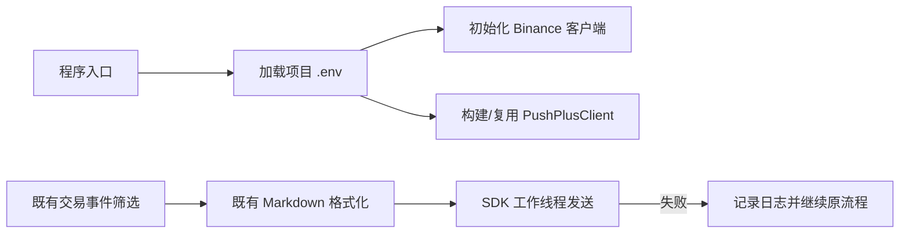

# .env 凭证与 PushPlus SDK 迁移方案

## 0. 需求摘要

- Binance `api_key` / `api_secret` 不再从 `bn.json` 读取，改由项目 `.env` 注入。
- PushPlus token 与 SDK 所需 secret key 同样由 `.env` 注入。
- PushPlus 使用 `perk_pushplus` SDK 发送 Markdown，不再维护 HTTP 请求协议。
- 成功标准：现有 AUTOBN/AUTOA 通知筛选、Markdown 内容、企业微信流程和失败隔离保持不变；真实秘密不进入 Git。
- 明确不做：不修改交易策略、消息范围、消息文案、重试机制和企业微信配置。

## 1. 决策与约束

- 配置源统一为进程环境；项目入口加载项目根目录 `.env`，部署环境仍可直接注入同名变量。
- 变量名锁定为 `BINANCE_API_KEY`、`BINANCE_API_SECRET`、`PUSHPLUS_TOKEN`、`PUSHPLUS_SECRET_KEY`。
- Binance 显式 `from_cfg(api_key=..., api_secret=...)` 保留为测试/调用方覆盖入口，优先级为显式参数高于环境变量；移除 `bn_api_file` 生产配置契约。
- `.env` 必须被 Git 忽略；仓库只保留无真实值的 `.env.example`。
- SDK 客户端按凭证缓存复用；若 SDK 发送接口为同步调用，则从异步交易流程切换到工作线程，避免阻塞事件循环。
- SDK 初始化或发送异常沿现有通知通道边界记录，不影响交易、持仓、Excel 或企业微信。
- 复杂度走默认档位；只新增配置加载与 SDK 适配，不引入配置框架、队列或重试系统。

## 2. 方案

### 2.1 名词层：现状 → 变化

**现状**

- `AUTOBN.from_cfg` 接受 `bn_api_file`，读取包含 `api_key` / `api_secret` 的 JSON，再回退到环境变量。
- `send_pushplus` 接受 `aiohttp.ClientSession`、通知对象和可选 token，自行构造 Markdown HTTP payload。

**变化**

- `bn.json` 凭证配置退出运行契约，Binance 凭证由显式参数或已加载的环境变量提供。
- 新增四项环境变量契约：

```text
BINANCE_API_KEY=
BINANCE_API_SECRET=
PUSHPLUS_TOKEN=
PUSHPLUS_SECRET_KEY=
```

- `TradeNotification` 与格式化/分类接口保持不变。
- `send_pushplus` 不再需要 HTTP session；它读取 PushPlus token，并在已配置时同时读取 secret key，通过 `PushPlusClient` + Markdown 模板发送。token 未配置时返回 `False`；secret key 仅开放接口必需，不作为普通消息发送前提。SDK 失败则抛出不含秘密的异常，由现有调用边界隔离。

### 2.2 编排层：现状 → 变化



**现状**：入口显式传入 `bn.json` 路径；两个 `send_msg` 通道把共享 `aiohttp` session 传给自写 HTTP 发送器。

**变化**：入口先加载根目录 `.env`，AUTOBN 直接从环境取 Binance 凭证；通知调用不再传 session，SDK 发送与企业微信 HTTP session 相互独立。事件筛选、格式化和企业微信调用顺序不变。

### 2.3 挂载点

1. 项目入口的 `.env` 加载。
2. `AUTOBN.from_cfg` 的 Binance 环境凭证解析。
3. PushPlus 通知模块的 SDK 客户端构建与 Markdown 发送。
4. `.gitignore` / `.env.example` 的秘密保护和配置契约。

### 2.4 推进策略

1. **依赖与配置骨架**：用 `uv add` 安装 SDK 与 `.env` 加载依赖，核实 SDK 实际 API；退出信号为包可导入且四个变量可从 `.env` 加载。
2. **Binance 凭证迁移**：移除运行入口和 `from_cfg` 对 `bn.json` 的依赖；退出信号为显式参数与环境变量场景测试通过，旧参数引用清零。
3. **PushPlus SDK 适配**：以 SDK Markdown 发送替换 HTTP；退出信号为 mock SDK 验证 token、secret key、标题、正文、Markdown 模板及异步隔离。
4. **回归与真实通道验证**：运行交易/通知测试，并使用本地 `.env` 做一次真实 SDK 推送；退出信号为测试全绿、SDK 返回成功且日志/提交中无秘密。

### 2.5 结构健康度与微重构

- 文件级：`autoTrade_pm.py` 很大，但本次只替换配置读取和两个通知调用点；拆分该文件会扩大风险，本次不做微重构。
- 目录级：`tokenDemo/` 已有独立通知模块和对应测试，继续在该模块内适配 SDK，不新增平行通知目录。
- compound 未记录目录组织或凭证约束。
- 超出范围的观察：`autoTrade_pm.py` 多职责问题继续留给独立 refactor，不阻塞本 feature。

## 3. 验收契约

- 根目录存在有效 `.env` → 程序可初始化 Binance 客户端，不访问 `bn.json`。
- 显式传入 Binance 凭证 → 显式值覆盖环境值，便于测试和受控调用。
- Binance 凭证缺失 → 初始化明确失败，错误信息只指向环境变量/显式参数，不包含秘密。
- PushPlus token 缺失 → 跳过 PushPlus，企业微信和交易流程继续；secret key 缺失不影响普通消息发送。
- 触发既有 AUTOBN 或 AUTOA N 交易通知 → SDK 收到相同标题、正文和 Markdown 模板。
- SDK 构建/发送失败 → 只记录不含秘密的错误，原交易与企业微信流程继续。
- `.env` 存在于本地 → Git 不跟踪；`.env.example` 仅含变量名和空值。
- 反向核对：代码中无 PushPlus `/send` URL、无 `session.post` 通知实现、无生产 `bn_api_file` 引用；推送筛选和消息格式测试保持通过。

## 4. 风险与回滚

- SDK 文档与已发布包 API 可能漂移：实现前通过安装后的运行时签名和最小调用验证，不按截图猜测。
- SDK 可能是同步 I/O：统一在线程中执行，避免阻塞异步调度器。
- `.env` 加载路径可能受启动目录影响：按源码所在项目根目录解析，不依赖当前工作目录。
- 回滚时恢复上一提交的 JSON/HTTP 实现并移除新增依赖；`.env` 中秘密始终留在本地，不参与回滚或提交。
