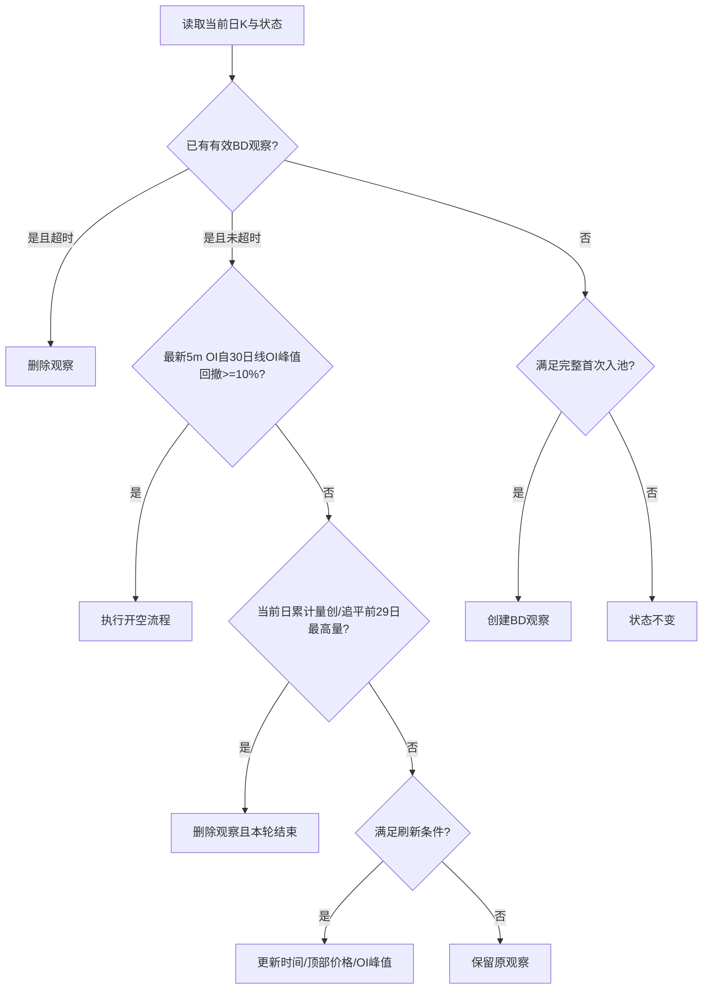

# bd-two-cohort-cost design

## 0. 术语约定

- **当前日K快照**：Binance `1d` K线最后一根；价格是当前最新价，成交量是当日累计量。它不是已收盘K线，但仍直接使用日K接口数据，不用分钟K替换。
- **OI实时30根窗口**：29个已完成日级OI快照，加当天最新且新鲜的5m OI；只补当天OI，不平移或覆盖日K字段。
- **基线窗口 / 旧成本窗口 / 高位窗口**：OI实时30根窗口依次切为前20根、中间7根、最近3根。
- **首次入池**：没有BD观察时，完整证明旧成本多头与高位新增多头结构。
- **刷新**：已有BD观察时，只延长仍在发展的顶部状态，不重复证明旧成本区。
- **新天量失效**：已有观察尚未开仓时，当前日累计量创或追平此前29根日K最高量，原观察立即删除。

## 1. 决策与约束

### 需求摘要

为 AUTOBN BD 建立逐轮运行的双层多头成本模型：旧成本窗口先出现30日量峰与切比雪夫极端OI，高位窗口的OI再超过旧窗口峰值，而最近3根不形成新天量；已有观察等待5m OI从顶部峰值回撤10%后开空。

成功标准：生产与回测使用同一状态机语义；日K字段不被分钟数据替换；当天OI只由新鲜5m数据补齐；连续满足时刷新，量峰滑出10日不撤销观察，当日新天量则撤销。

明确不做：

- 不将价格条件改为 high-to-high，继续使用当前日K最新价相对前29日最高close。
- 不用分钟K重建或覆盖日K价格、成交量。
- 不新增多空比入池或开仓门槛；仅审查并守住“当天值必须是新鲜分钟数据”的数据契约。
- 不修改10% OI回撤阈值、ATR止盈止损和基差率逻辑；AUTOBN观察超时统一从5天调整为7天。
- BD开仓沿用AUTOBN多头的日K价格方向口径并镜像判断：开多为当前最新价高于上一根日K close，开空为当前最新价严格低于上一根日K close；不额外引入当日open比较。
- “下单失败仍落盘本地持仓”的既有缺陷不混入本feature验收；按用户要求已通过独立 `cs-issue` 快速通道修复并单独留痕。

### 复杂度档位

走现有交易策略内部功能默认档位；状态持久化沿用 `alert_all`，不新增数据库、服务或外部依赖。

### 关键决策

1. 旧成本OI切比雪夫硬门槛固定 `<5%`，不以 `<1%` 代替；1%不新增标签。
2. 当前价格和当日累计成交量直接取最后一根 `1d` K线；只有当天OI使用最新5m点补入日级历史。
3. 首次入池要求 `max(recent_oi) > max(old_oi)`；最近3日不再单独计算切比雪夫。
4. 切比雪夫基线按每次判断时的实时30根窗口滚动，不保存首次入池基线。
5. Observation和Position模型均不增加OI字段；开仓时每轮重新读取最近30个已完成日线OI，以其最高值作为回撤基准。
6. 每轮顺序固定为：超时守卫 → 已有观察检查开仓 → 新天量删除 → 刷新 → 无观察时首次入池。新建观察不得同轮开仓。
7. 当天新天量删除后，同轮不重新首次入池；下一轮/次日由无观察状态自然重判。
8. 日级OI按API时间戳选择“当前时刻之前已完成且可得”的历史点，不用本地08:00精确相等推断业务日期。

## 2. 名词与编排

### 2.1 名词层

#### 现状

- `tokenDemo/autoTrade_pm.py` 的 `Observation` 只保存价格、时间、方向和策略，没有OI峰值。
- `_is_bd_observation` 接收日K close/volume，再独立获取30条日级OI；无法表达“29个历史日OI + 当天5m OI”。
- SHORT `check_side` 用最新5m OI对日级OI窗口峰值计算回撤，未绑定具体观察的峰值。
- 多空比加载器返回1h历史与最新5m点的混合列表；BD SHORT当前不消费它。

#### 变化

- **扩展BD观察状态**：不修改Observation或Position模型；BD观察继续使用现有价格、时间、方向与策略字段，OI回撤基准由每轮可得的30个已完成日线OI现场计算。
- **引入OI实时窗口值对象语义**：复用现有 `_get_oi_1d_data`、`_get_oi_5m_data` 和切比雪夫计算能力，在其上建立最小窗口构造层；历史段只包含已完成日级OI，当天段只来自新鲜5m OI；窗口不足或5m点过期时拒绝创建/刷新BD，不重复请求API或另写统计实现。
- **区分首次入池与刷新结果**：判断结果明确表达“创建、刷新、删除或不变”，不再用一个布尔条件覆盖全部状态变化。

接口行为示例：

```text
输入：29个已完成日级OI + 最新5m OI
输出：30根实时OI窗口；若5m点不新鲜则无有效窗口
// 来源：autoTrade_pm.py _get_oi_1d_data / _get_oi_5m_data
```

```text
输入：无BD观察 + 当前日K窗口 + OI实时窗口
输出：满足四项条件时创建现有结构的BD观察，否则状态不变
// 来源：autoTrade_pm.py _is_bd_observation / rzq_token
```

### 2.2 编排层



#### 现状

`rzq_token` 是分支状态机：先管理持仓或已有观察，再执行每日一次的通用BZ/BD观察写入。BD入池仅有静态三条件；同一UTC日不重复刷新。开仓另有“当前价低于上一根日K close”的价格方向守卫。

#### 变化

- 保留“已有观察先开仓、之后才更新观察池”的主拓扑，并把BD更新拆为专属状态转换。
- 首次入池：当前价处于30日最高close；中间7根产生30日唯一有效量峰；旧7根OI峰值相对前20根切比雪夫 `<5%`；最近3根OI峰值超过旧7根。
- 刷新：当前价仍处于顶部；最近3根不含30日量峰；当前滚动窗口最近3根OI峰值仍超过旧7根。刷新不重复切比雪夫与旧量峰位置证明。
- 新天量删除：只针对已有BD观察；在开仓未触发后执行，并列最高同样删除。
- 开仓：最新5m OI相对最近30个已完成日线OI的最高值回撤至少10%，且当前最新价严格低于上一根日K close，两者同时成立才通过；价格方向与现有开多条件严格镜像。
- 新建观察同轮不进入开仓；后续扫描才可触发。

#### 流程级约束

- 5m OI必须有时间戳且处于允许的新鲜度窗口；过期数据不得入池、刷新或开仓。
- OI和日K按“数据可得时间”处理，禁止把下一日才发布的数据偷放入前一日盘中回测。
- 同一轮开仓条件与新天量同时成立时，开仓优先。
- 不满足刷新只保留旧观察；只有开仓、超时或新天量明确删除。AUTOBN观察从最后更新时间起7天超时；AUTOA的30天观察期不变。
- BZ、AUTOA和非BD Observation不受新增BD字段及状态转换影响。
- 可观测日志区分：首次入池、刷新、新天量删除、超时、OI回撤开仓，以及拒绝原因。

### 2.3 挂载点清单

本feature不引入新路由、配置、定时任务、外部接口或数据库挂载点；它替换AUTOBN内部BD策略状态机，删除该内部策略分支即可卸载。

### 2.4 推进策略

1. 数据契约：建立日级历史OI与当天5m OI的无未来数据窗口；退出信号是时间戳、新鲜度和30根切分边界测试通过。
2. 状态契约：保持Observation和Position模型不变；退出信号是旧JSON及非BD观察继续兼容加载。
3. 计算节点：实现首次入池、刷新和新天量失效判定；退出信号是每个条件及并列量峰边界均有测试。
4. 编排骨架：接入“超时→开仓→删除→刷新→首次入池”状态机；退出信号是逐轮场景的状态转换与设计一致。
5. 开仓节点：以最近30个已完成日线OI的最高值为基准计算最新5m OI的10%回撤，并沿用与开多严格镜像的“当前价低于上一根日K close”方向守卫；退出信号是OI阈值两侧和价格方向边界测试通过。
6. 超时节点：将AUTOBN通用观察有效期统一调整为7天，不改变AUTOA的30天有效期；退出信号是7天边界及策略隔离测试通过。
6. 回归验证：以逐轮状态场景和数据可得边界测试验证生产状态机，并跑完整AUTOBN/AUTOA回归；退出信号是无未来数据边界与既有测试全部通过。历史收益重算受Binance日级OI留存长度限制，沿用已有校准审计，不作为本次生产功能验收门槛。

### 2.5 结构健康度与微重构

#### 评估

- 文件级 — `tokenDemo/autoTrade_pm.py`：约3500行，承担模型、API适配、策略计算、状态编排和交易执行；本次会触及多个独立位置，明显偏胖。
- 文件级 — `tokenDemo/test_autoTrade_pm.py`：集中承载现有交易行为刻画，本次扩展仍属于同一AUTOBN测试职责。
- 目录级 — `tokenDemo/`：已有多个交易与校准脚本，但本次不计划新增生产模块或两个以上同层文件。
- compound约束：遵循 `2026-07-25-bz-is-bd-short-taboo.md`，最近3日新天量是BD禁忌而非正向条件。

#### 结论：不做微重构

`autoTrade_pm.py` 确实偏胖，但拆文件会扩大本次策略行为变更的验证面；本feature只做必要的状态与计算改动，结构拆分后续单独走 `cs-refactor`。回测逻辑沿用现有校准工具，不新增平行生产实现。

#### 超出范围的观察

- `autoTrade_pm.py` 下单失败仍落盘本地持仓的问题已按用户要求通过独立 `2026-07-25-open-failure-local-position` issue 修复，不计入本feature验收。
- 多空比加载器混合1h历史和5m末项，调用方可能将缺失5m时的1h末项当实时值，建议另行审计/issue；BD本次不新增多空比消费。

## 3. 验收契约

### 关键场景清单

1. 29个历史日OI与一个新鲜5m OI输入时，形成30根窗口；过期、缺失或未来时间戳的5m点拒绝。
2. 当前日K最新价创前29日最高close、旧7根为30日量峰、旧OI切比雪夫 `<5%`、最近3根OI超过旧峰时，首次创建现有结构的BD观察。
3. 切比雪夫上界恰好5%不入池；低于5%才入池。
4. 最近3根OI等于或低于旧峰不入池；严格超过才入池。
5. 最近3根出现并列或更高30日量峰时不首次入池；已有BD观察在未开仓后立即删除，且同轮不重建。
6. 旧量峰后续滑出中间7根，但没有新天量时，已有观察不因该原因删除。
7. 已有观察继续价格创新高、近期OI创新高且无新天量时，刷新时间和顶部价格；切比雪夫基线按当前窗口滚动但刷新不重复旧窗口门槛。
8. 不满足刷新但无新天量时，原观察保持不变直到7天超时。
9. 有效观察下，最新5m OI相对最近30个已完成日线OI峰值回撤恰好10%，且当前最新价严格低于上一根日K close时可开空；OI仅回撤9%、价格等于或高于昨收均不通过。
10. 同轮同时满足OI回撤和新天量时，先走开仓；新建观察同轮不得开仓。
11. 日K价格和成交量始终来自`1d` K线最后一根，代码不请求分钟K来替换这些字段。
12. 日级OI时间戳按实际可得边界选择历史点，不依赖进程本地时区的08:00精确相等。
13. BZ、AUTOA和旧Observation数据可兼容运行；现有全量测试与回测parity通过。

### 明确不做的反向核对

- 代码中不出现 high-to-high BD价格门槛。
- 代码中不出现分钟K补写日K close或volume。
- BD SHORT不新增多空比入池/开仓判断。
- ATR、基差率和10%常量不改变；AUTOBN观察超时常量调整为7天，AUTOA的30天常量不变。
- 本feature不重复实现或验收已由独立issue完成的下单失败落盘修复。

## 4. 与项目级架构文档的关系

本feature局限在AUTOBN内部策略状态机，不新增系统级模块边界或外部契约。若验收证明“日级历史 + 当天分钟快照”的数据可得时间规则可复用于其他策略，再单独通过 `cs-keep` 沉淀；本阶段不提前升级为ADR。
