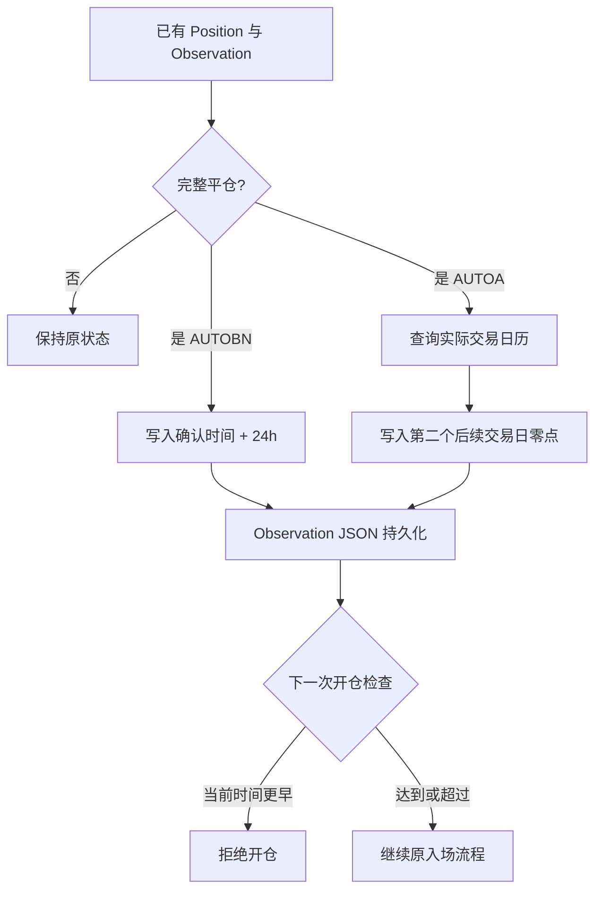

# shared-observation-reopen-cooldown design

## 0. 术语约定

- **最早开仓时间**：`Observation.earliest_open_timestamp`，可选 Unix 时间戳；`None` 表示没有冷却限制。
- **AUTOBN 冷却**：成功清除仓位后的连续 24 小时禁止同一标的重开。
- **AUTOA 冷却交易日**：平仓后的第一个实际 A 股交易日完整禁止开仓，第二个后续交易日开始允许；周末和法定休市日不计。

## 1. 决策与约束

### 需求摘要

AUTOBN 与 AUTOA 使用同一个 Observation 数值字段保存同标的最早可重开时间，并随既有 Observation JSON 持久化，保证进程重启不丢失。AUTOBN 保持 24 小时口径；AUTOA 使用实际交易日历，例：7 月 22 日平仓，7 月 23 日禁止，7 月 24 日允许。

成功标准：平仓后冷却值写入已有 Observation；开仓前统一读取；旧 JSON 兼容；AUTOBN 不再使用独立 `CLOSE_TS` 状态源。

明确不做：

- 不用 `0` 表示未设置，新建 Observation 默认 `None`。
- 不把 AUTOA 冷却简化为 48 小时、自然日或工作日。
- 不处理“Position 存在但 Observation 不存在”的异常状态，不补造 Observation。
- 不修改 Observation 删除逻辑，也不增加删除前 Position 保护。
- 不改变两类策略的其他入场、出场、观察超时和风控条件。

### 复杂度档位

走现有进程内状态模型默认档位；复用 `alert_all` JSON 与 A 股交易日历，不增加依赖、数据库或外部服务。

### 关键决策

1. 共用字段为 `earliest_open_timestamp: Optional[float] = None`；缺字段的旧 JSON 自动恢复为 `None`。
2. 只有完整平仓或已确认交易所仓位为零时写冷却；部分平仓不写。
3. AUTOBN 写入“确认清仓时间 + 24 小时”，开仓时使用严格 `<` 判断，边界时刻允许。
4. AUTOA 从完整市场交易日历中选择平仓日后的第二个交易日，并写该日零点时间戳；该日期起允许开仓。
5. 交易日历无法确定第二个后续交易日时，不删除仓位或伪造自然日冷却，保留状态并记录失败。

## 2. 名词与编排

### 2.1 名词层

#### 现状

共用 `Observation` 保存观察价格、时间、方向、策略和名称；AUTOBN 另以 `alert_all["CLOSE_TS"]` 保存最近平仓时间；AUTOA 没有持久化重开冷却。

#### 变化

Observation 增加可选数值字段。实例序列化后字段为数值或 `null`，旧 JSON 缺字段可加载。平仓路径更新已有 Observation，开仓路径读取同一对象，不再维护平行冷却字典。

```text
新观察 → earliest_open_timestamp = null
完整平仓 → earliest_open_timestamp = 最早允许重开的 Unix 时间戳
重启加载 → model_validate 恢复同一值
```

### 2.2 编排层



#### 现状

AUTOBN 在三个确认清仓分支写 `CLOSE_TS`，开仓前从该字典计算 24 小时；AUTOA 平仓后直接移除 Position，后续 Observation 可按原规则重新开仓。

#### 变化

AUTOBN 三个确认清仓分支统一更新已有 Observation 的最早开仓时间并移除 `CLOSE_TS` 初始化、读写。AUTOA 在移除 Position 前先通过市场交易日历确定第二个后续交易日，更新 Observation 后再完成平仓状态转换。两者在已有 Observation 的开仓编排入口增加同语义守卫。

#### 流程级约束

- 冷却值必须在移除 Position 的同一状态更新中写入 Observation。
- 当前时间等于最早开仓时间时允许继续。
- AUTOA 的交易日序列必须包含未来交易日，不能只复用“截至今天”的回看列表计算未来日期。
- 日历获取失败时不得退化为自然日近似。
- 不创建第二份兼容读取逻辑；迁移后 `CLOSE_TS` 即停止使用。

### 2.3 挂载点清单

1. 共用 Observation 的最早开仓时间字段。
2. AUTOBN 完整平仓写入与开仓守卫。
3. AUTOA 完整平仓交易日计算、写入与开仓守卫。
4. 既有 Observation JSON 持久化链路。

删除以上四项即可卸载本功能，不留外部登记。

### 2.4 推进策略

1. 状态契约：扩展 Observation 并验证旧 JSON、`null` 和数值往返；退出信号是兼容与持久化场景通过。
2. AUTOBN 迁移：三个清仓分支改写 Observation，开仓守卫改读字段并清理 `CLOSE_TS`；退出信号是 24 小时两侧边界及无旧引用通过。
3. AUTOA 日历：按完整市场交易日历得到第二个后续交易日并原子更新状态；退出信号是连续交易日、周末和法定休市场景通过。
4. 回归与验收：运行完整测试和静态检查，回写需求及验收；退出信号是相关行为无回归。

### 2.5 结构健康度与微重构

`autoTrade_pm.py` 已明显偏胖并混合模型、交易所适配和两类策略；测试文件同样集中，但本次逻辑必须挂入现有状态转换。拆分会扩大行为变更验证面，且 compound 中没有目录归属约束，因此本次不做微重构，只增加一个内聚的交易日计算节点并定点修改现有编排。结构拆分后续应单独走 `cs-refactor`。

## 3. 验收契约

1. 新建 Observation 未传字段时为 `None`，序列化为 `null`；旧 JSON 缺字段可加载。
2. 数值冷却经 `model_dump` / `model_validate` 后保持不变。
3. AUTOBN 确认清仓后写“清仓时间 + 24h”；提前一秒禁止，恰好边界允许。
4. AUTOBN 状态初始化、平仓和开仓均不再出现 `CLOSE_TS`。
5. AUTOA 周三平仓，周四禁止，周五允许。
6. AUTOA 周五平仓，周一禁止，周二允许。
7. AUTOA 遇法定休市日时跳过休市日，以第二个实际后续交易日为允许日期。
8. 冷却中的 AUTOA 不请求行情或执行原入场判断；到期后继续原流程。
9. 部分平仓不设置冷却；无 Observation 的异常状态不新增兜底。
10. 完整相关测试与 Ruff 通过。

### 明确不做的反向核对

- 不出现 AUTOA `timedelta(days=2)`、48 小时或仅排除周末的计算。
- 不新增 Position 冷却字段、独立 AUTOA 平仓日期字典或替代 JSON。
- 不更改 Observation 删除保护和策略阈值。

## 4. 与项目级架构文档的关系

本功能把两个策略已有的同类状态统一收敛到共享 Observation 模型，未改变模块边界。该重启持久化行为作为新能力回写独立 requirement；无跨模块 ADR。
