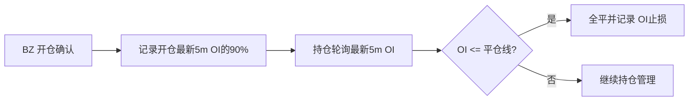

# BZ 多头 OI 回撤平仓设计

## 0. 需求摘要

BZ 多头开仓时记录当时最新 5m OI 的 90% 作为独立 OI 平仓线；持仓期间最新 5m OI 跌至该线即全平，不再要求多空比大于 1。

## 1. 决策与约束

- 新增 BZ 多头专用回撤比例，默认 10%，不复用 BD 的入池扣扳机常量，保证两侧可独立调参。
- `stop_guard_threshold` 继续承载 AUTOBN 多头 OI 平仓线，不新增持仓字段，不迁移既有持仓数据。
- OI 平仓仍只在价格止盈、价格止损均未触发时检查；触发后沿用现有全平流程和“OI止损”原因。
- 不再为该平仓规则获取或判断 5m 多空比。
- 不改变 BZ 入池、blend、切比雪夫、OI 创新高、ATR 止盈止损、DCA 和 BD 逻辑。
- 复杂度走默认档位：单策略、单状态字段、线性判断，无新模块或外部接口。

## 2. 方案

### 2.1 名词层：现状 → 变化

**现状**：BZ 开仓把切比雪夫基线区间的平均 OI 写入 `stop_guard_threshold`；该字段代表“回落至历史常态”的绝对阈值。

**变化**：`stop_guard_threshold` 改为“本次 BZ 开仓 OI 的回撤线”：

```text
开仓最新 5m OI = 200
BZ 多头 OI 回撤比例 = 10%
stop_guard_threshold = 180
```

新增独立概念 `BZ_LONG_OI_DRAWDOWN_RATIO = 0.1`。已有持仓若字段为 0，继续不启用 OI 平仓；已有非零旧值不做迁移，按其持久化值继续运行直至仓位结束。

### 2.2 编排层：现状 → 变化



**现状**：开仓确认返回历史平均 OI；持仓检查先请求 5m 多空比，仅当 `LSR > 1` 时再请求 5m OI，并与历史平均线比较。

**变化**：开仓确认返回开仓最新 5m OI 的 90%；持仓检查直接请求最新 5m OI，与持仓保存的绝对平仓线比较。数据不可用时不触发 OI 平仓，继续执行现有持仓逻辑。

### 2.3 挂载点

1. BZ 多头回撤比例配置：删除后恢复旧阈值口径。
2. BZ 开仓阈值生成：删除后不再以开仓 OI 建立平仓线。
3. 多头持仓 OI 检查：删除后不再按独立回撤线平仓。
4. 行为测试：固化阈值生成、边界触发和不依赖 LSR。

### 2.4 推进策略

1. 调整阈值生成并固化 10% 边界；退出信号：开仓 OI 为 200 时持仓字段为 180。
2. 调整持仓编排，移除 LSR 门槛；退出信号：OI 等于或低于180全平，高于180不平，LSR 接口不再调用。
3. 执行相关测试、全量单测和 Ruff；退出信号：全部通过。

### 2.5 结构健康度与微重构

`autoTrade_pm.py` 文件偏大且 AUTOBN 职责较多，但本次只替换一个阈值来源和一段既有判断；拆文件会扩大交易主路径改动面。目标目录也不新增代码文件。**本次不做微重构**，只做最小行为调整。跨策略拆分类属于后续独立 `cs-refactor` 范围，不阻塞本功能。

## 3. 验收契约

1. BZ 开仓最新 5m OI 为 200、回撤比例为10%时，持仓保存的 `stop_guard_threshold` 为180。
2. 多头持仓最新5m OI为180或更低时，即使多空比不大于1或不可用，也以“OI止损”全平。
3. 最新5m OI高于180时不触发OI平仓。
4. 最新5m OI不可用时不误平仓。
5. 空头仓位不使用该规则。
6. BZ 入池、开仓 blend/切比雪夫/OI创新高以及BD逻辑保持不变。
7. `BD_OI_DRAWDOWN_RATIO` 调整不会影响BZ多头平仓比例，反向亦然。

## 4. 卸载与影响

卸载时恢复 BZ 开仓的历史均值阈值、恢复持仓阶段 LSR 门槛并删除独立常量与对应测试即可。预期影响是 BZ 多头在开仓 OI 回撤10%后更早退出；可能增加正常 OI 波动造成的提前离场，但不会改变价格止盈止损路径。
