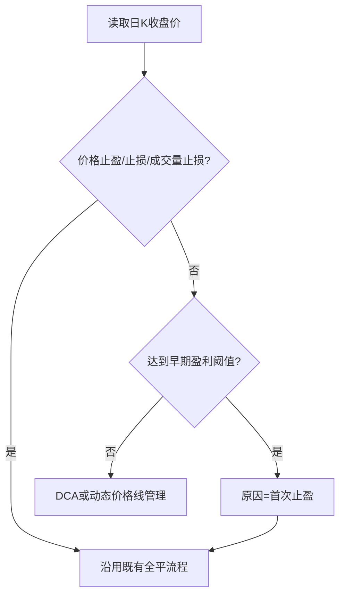

# AUTOA 早期盈利全平设计

## 0. 术语约定

- **首次止盈**：达到早期盈利阈值后执行的第一次盈利平仓；平仓原因与AUTOBN一致。
- **早期盈利阈值**：当前止盈距离1/3、1 ATR和入场价5%的最小值。

## 1. 决策与约束

AUTOA在持仓日之后达到早期盈利阈值时直接全平100%，不再只提高止损。复用现有观察冷却、通知和收益记录流程。

复杂度走默认档位。明确不做：不做部分平仓，不设置下一止盈或止损，不改DCA、ATR价格线、成交量止损、行情源和轮询频率。

## 2. 名词与编排

### 2.1 名词层

**现状**：AUTOA持仓以`Position`保存止盈、止损和原因，早期盈利只写入追踪止损。

**变化**：不新增字段；早期盈利触发后将`close_reason`设为“首次止盈”。例如入场10、当前止盈13、ATR 2、当前价10.5时，阈值为`min(1, 2, 0.5)=0.5`，结果为全平且原因“首次止盈”。

### 2.2 编排层

**现状**：早期盈利判断位于未触发既有退出后的动态价格线分支，只上移止损。

**变化**：把早期盈利提升为退出触发，与既有三类退出互斥；触发后进入同一个全平、冷却、通知及记录流程。既有退出保持优先。

### 2.3 挂载点

1. AUTOA持仓退出触发集合增加首次止盈。
2. 平仓原因统一为“首次止盈”。
3. 早期盈利全平场景测试。

### 2.4 推进策略

1. 接入早期盈利触发和原因，退出信号为触发后进入既有全平流程。
2. 移除旧的仅追踪止损职责，退出信号为阈值分支不再更新价格线。
3. 补齐互斥、全平和回归测试，退出信号为相关及全量验证通过。

### 2.5 结构健康度与微重构

已检查compound目录组织约定，无命中。本次只调整既有AUTOA编排的一处局部分支，不新增生产文件；测试仍落在既有测试模块。本次不做微重构，避免把行为变更与大文件拆分混合。

## 3. 验收契约

- 持仓日之后，未触发既有退出且浮盈等于或超过早期阈值时，全平100%并记录“首次止盈”。
- 浮盈低于阈值时不平仓，继续既有DCA或动态价格线管理。
- 价格止盈、价格止损或成交量止损已触发时，不重复执行首次止盈。
- 全平后沿用既有观察冷却、通知和收益记录。
- 反向核对：没有部分平仓、下一阶段价格线或AUTOBN改动。

## 4. 领域影响

复用既有止盈与全平语义，不新增跨模块术语、结构决策或稳定协议。
