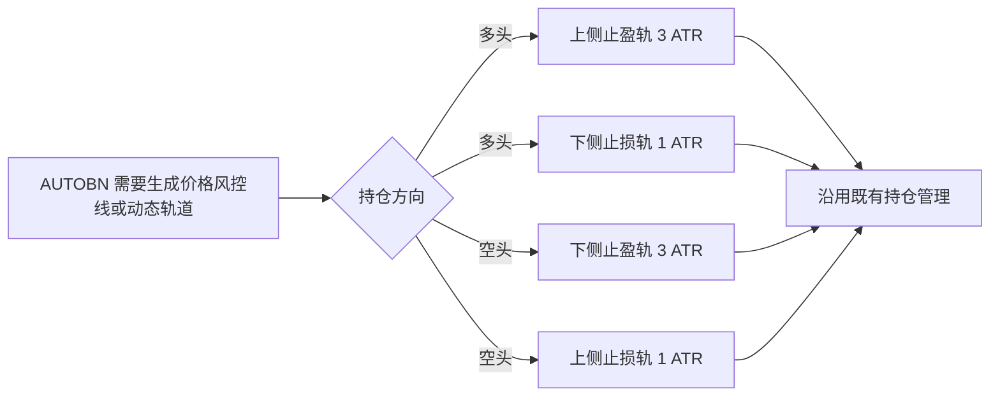

# AUTOBN ATR 止损距离拆分设计

## 0. 需求摘要

AUTOBN 的 ATR 止盈继续使用 3 倍 ATR，ATR 止损改为独立的 1 倍 ATR：

```text
多头：take_profit = 基准价 + 3 ATR；stop_loss = 基准价 - 1 ATR
空头：take_profit = 基准价 - 3 ATR；stop_loss = 基准价 + 1 ATR
```

这里的“基准价”沿用各条既有路径当前传入的价格，不改变其来源。

## 1. 决策与约束

- 该能力属于 AUTOBN 现有价格风控，不新建策略模块或持仓字段。
- AUTOBN 新增按风控职责区分的止盈、止损 ATR 倍数，默认分别为 3.0 和 1.0；初始价格线与动态轨道均使用这两个参数，不再以一个统一 `SUPERTREND_FACTOR` 同时生成两侧轨道。
- 轨道按持仓方向映射职责：多头上侧为3 ATR止盈轨、下侧为1 ATR止损轨；空头下侧为3 ATR止盈轨、上侧为1 ATR止损轨。
- 统一计算入口产出的新距离同时用于首次信号、止盈止损缺失时的初始化，以及部分平仓后剩余仓位的重算。
- 已有持仓不迁移：已保存的非零止盈止损继续使用；只有进入既有重算路径时才采用新公式。
- 不改变 ATR 算法和上限、仓位计算公式、价格触发优先级、OI 平仓、DCA 阈值与专用止盈收紧、Supertrend/盈利移动止损、追踪止损和 AUTOA。AUTOA 当前仍以其自身 `SUPERTREND_FACTOR` 同时计算轨道和初始价格线，作为明确的范围外事项保留。
- 复杂度走默认档位：单一计算规则调整，无新接口、状态或外部依赖。

## 2. 方案

### 2.1 名词层：现状 → 变化

**现状**：AUTOBN 使用一个 3.0 倍数同时计算止盈距离与止损距离。例如基准价 100、ATR 2 时，多头得到 `(106, 94)`，空头得到 `(94, 106)`。

**变化**：引入 AUTOBN 专用的“止盈 ATR 倍数”和“止损 ATR 倍数”，默认分别为 3.0 和 1.0；既有统一 `SUPERTREND_FACTOR` 不再用于 AUTOBN 初始价格线和动态轨道。同一输入改为：

```text
多头：基准价 100、ATR 2 → (take_profit=106, stop_loss=98)
空头：基准价 100、ATR 2 → (take_profit=94, stop_loss=102)
ATR <= 0 → 仍返回 (0, 0)
```

不新增持仓字段；持仓仍保存计算后的绝对止盈价与止损价。

### 2.2 编排层：现状 → 变化



**现状**：首次开仓、缺失价格线初始化及部分平仓后的剩余仓位重算都调用同一计算入口；该入口用统一3 ATR距离生成两条价格线。持仓管理也用同一3 ATR倍数生成 `current_upper/current_lower`，再分别作为多空止盈收紧与移动止损的参考轨。

**变化**：保持三条价格线调用路径及其基准价不变，统一入口分别计算3 ATR止盈和1 ATR止损；动态轨道也按方向和职责分别生成。多头管理接收“上侧3 ATR止盈轨、下侧1 ATR止损轨”，空头管理接收“下侧3 ATR止盈轨、上侧1 ATR止损轨”。首次开仓的风险仓位计算自然接收较近的止损价，但定仓公式及所有限额保持不变。部分平仓后的剩余仓位仍以既有成交检测价作为基准重算，不改为持仓均价。

流程约束：

- DCA 成功后仍只收紧专用止盈，不按新均价重建止损。DCA 线以实际 `entry_price` 为基准，初始止损线以信号 K 线 `hl2` 为基准；二者的先后取决于开仓价相对 `hl2` 的位置，不能仅按同为 1 ATR 判断谁先触发。
- 移动止损与追踪规则可以在持仓期间继续单向收紧绝对止损价；3 ATR / 1 ATR 是生成或重算时的距离，不是全生命周期固定比例。
- 已保存的有效价格线不因发布自动重算，避免运行中持仓被无条件改变。

### 2.3 挂载点

1. AUTOBN 专用止盈与止损 ATR 倍数：删除后初始价格线和动态轨道无法按风控职责独立调节。
2. AUTOBN 价格线计算规则：恢复统一距离后，新开仓、缺失值初始化和部分平仓重算的可观察行为消失。
3. AUTOBN 多空动态轨道映射：恢复统一上下轨后，持仓期间的止盈轨与止损轨不再分别使用3 ATR和1 ATR。
4. 多空数值及调用链回归测试：固化价格线与动态轨道均采用职责倍数。

### 2.4 推进策略

1. 拆分 AUTOBN 止盈与止损职责倍数；退出信号：固定输入下多头、空头分别得到3 ATR / 1 ATR价格线，非正ATR行为不变。
2. 将相同职责倍数应用于AUTOBN动态轨道；退出信号：多头为上3/下1，空头为下3/上1，持仓管理仍消费正确的止盈轨与止损轨。
3. 核对统一入口的三条生产调用路径；退出信号：首次信号、缺失值初始化和部分平仓重算均使用新结果，未新增平行计算。
4. 固化影响边界并执行验证；退出信号：风险仓位收到新止损价，DCA/追踪规则/AUTOA没有行为代码改动，相关测试、全量单测和Ruff通过。

### 2.5 结构健康度与微重构

`autoTrade_pm.py` 文件偏大且职责较多，但本次只调整既有计算节点并新增一个同域常量；拆文件会扩大交易主路径风险。目标 feature 目录只承载标准设计、清单和验收产物，不存在摊平问题。compound 中未发现要求为此类常量另建模块的目录约定。

**本次不做微重构**：采用最小行为改动。多个旧交易脚本中的同名方法以及 AUTOBN 类拆分属于超出范围的后续重构观察，不阻塞本功能。

## 3. 验收契约

1. 基准价100、ATR2的多头生成止盈106、止损98；空头生成止盈94、止损102。
2. ATR为0或负数时仍返回 `(0, 0)`。
3. 首次 AUTOBN 开仓信号使用3 ATR止盈和1 ATR止损，风险仓位计算接收该绝对止损价。
4. 已有 AUTOBN 持仓的任一价格线为0时，初始化结果使用3 ATR止盈和1 ATR止损。
5. 部分平仓后仍有剩余仓位时，以既有基准价重算为3 ATR止盈和1 ATR止损。
6. 多头和空头均满足上述行为。
7. 已保存非零价格线的既有持仓不会仅因新版本运行而自动重算。
8. DCA阈值、DCA专用止盈、追踪止损、ATR算法、OI退出和AUTOA保持不变；AUTOBN基于轨道的止盈收紧与移动止损只改变轨道距离。
9. AUTOBN不再以统一 `SUPERTREND_FACTOR` 生成初始价格线和动态轨道；调整止盈倍数不会改变止损轨，调整止损倍数不会改变止盈轨。
10. 多头动态轨道为上侧3 ATR、下侧1 ATR；空头动态轨道为下侧3 ATR、上侧1 ATR。
11. AUTOA的轨道与初始止盈止损计算不发生代码或行为变化。

## 4. 卸载与影响

卸载时删除 AUTOBN 专用止盈、止损倍数，让 AUTOBN 初始价格线与动态轨道恢复统一3 ATR距离，并移除对应回归测试即可；无数据迁移或外部接口残留。

预期影响：AUTOBN 新生成或重算的止损更近，首次开仓传入定仓公式的止损距离也变小，因此在现有“止损定仓与止盈定仓取平均”的公式下，未受限额约束时下单量会增加，但理论止损金额仍不是严格固定的账户10%。DCA 继续以实际开仓均价为基准，初始止损继续以信号 K 线 `hl2` 为基准；本次不改变两者的相对位置和触发编排。
