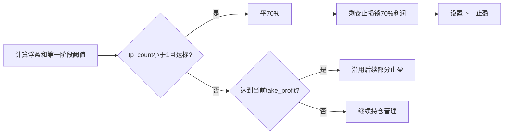

# AUTOBN 两阶段止盈设计

## 0. 需求摘要

首次浮盈达到 `min(当前止盈距离的1/3, 1 ATR, 开仓价5%)` 且 `tp_count < 1` 时，平仓70%，同轮把剩仓止损收紧到触发利润的70%，并以当前价加/减 `min(1 ATR, 当前价5%)` 设置下一止盈。该判断与既有绝对止盈同级互斥。

## 1. 决策与约束

- `tp_count < 1` 是第一阶段一次性守卫；成功部分平仓后递增并持久化。
- 多头、空头镜像；止损只收紧不放宽。
- 第一阶段与既有绝对止盈使用 `if/elif` 同轮只执行一个。
- 部分平仓成功且确有剩仓后才写入新价格线；失败时不得消耗阶段状态。
- 不改平仓比例70%、ATR算法、OI止损、DCA、AUTOA、价格数据源和轮询频率。

## 2. 方案

### 2.1 名词层：现状 → 变化

**现状**：早期盈利阈值只抬追踪止损；达到绝对 `take_profit` 才平70%。

**变化**：早期阈值成为“第一阶段止盈线”，成功后保存 `tp_count=1`、触发利润70%的保护止损及下一阶段绝对止盈价，不新增持仓字段。

### 2.2 编排层：现状 → 变化

第一阶段移入统一触发编排，与价格止损、绝对止盈同轮判断。成功成交后再提交阶段状态和价格线；后续轮次因 `tp_count >= 1` 跳过第一阶段。

### 2.3 挂载点

1. 第一阶段阈值与一次性守卫。
2. 同级互斥触发编排。
3. 部分平仓成功后的保护止损和下一止盈写入。
4. 多空、失败与重复触发回归测试。

### 2.4 推进策略

1. 建立第一阶段触发计算；退出信号：多空边界和 `tp_count` 守卫正确。
2. 接入70%部分平仓及成功后价格线提交；退出信号：同轮写入保护止损和下一止盈，失败不消耗状态。
3. 移除旧早期阈值仅追踪分支并验证互斥；退出信号：无重复职责。
4. 全量测试与Ruff；退出信号：全部通过。

### 2.5 结构健康度与微重构

目标文件偏大，但改动集中于既有触发与平仓编排；本次不拆文件，避免扩大交易路径风险。feature目录仅放标准产物，无目录重组需要。

## 3. 验收契约

1. `tp_count=0` 且浮盈等于第一阶段阈值时平当前仓位70%。
2. 成功后多头止损不低于 `entry + 浮盈×70%`，空头不高于镜像位置。
3. 下一止盈为当前价加/减 `min(ATR, 当前价×5%)`。
4. `tp_count>=1` 不再触发第一阶段。
5. 同轮同时满足第一阶段与旧止盈时只触发第一阶段。
6. 平仓失败或无确认剩仓时不错误提交新的阶段价格线。
7. 后续达到新止盈时沿用既有部分止盈。
8. OI、DCA、AUTOA及行情轮询不变。

## 4. 卸载与影响

恢复早期阈值仅追踪止损、删除第一阶段触发与成功后覆盖即可卸载。影响是更早兑现70%仓位，并把剩仓锁利与下一目标在成交成功同轮固化。
