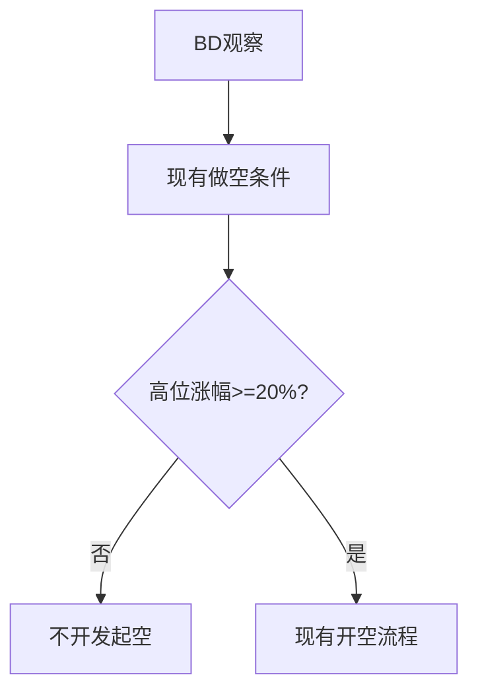

# AUTOBN 做空涨幅过滤设计
## 0. 术语约定
- 最高量基准日：当前30根日K窗口中成交量最高的日K。
- 高位涨幅：从最高量基准日开盘价到该日以来（含候选日）最高价的涨幅。
## 1. 决策与约束
最高量基准日以来的高位涨幅达到20%后，才允许现有做空条件继续开空。仅影响SHORT开仓；不改变BD入池、OI回撤、LONG、平仓及行情轮询。默认复杂度。
## 2. 名词与编排
### 2.1 名词层
现状：做空由BD观察状态、当前收盘低于前收及OI回撤条件共同决定。
变化：新增独立20%过滤常量。例：最高量日开盘100，之后最高价120，涨幅20%，过滤通过；最高价119，过滤不通过。
### 2.2 编排层

现状：现有short_ok后直接构造做空信号。
变化：在short_ok与构造信号之间加入高位涨幅门槛，使用同一批日K数据计算，避免额外数据源。
### 2.3 挂载点
1. 做空涨幅常量。
2. 做空开仓分支过滤。
3. 做空过滤测试与需求记录。
### 2.4 推进策略
1. 增加计算节点并接入SHORT分支；退出信号为多头路径无变化且低于20%拒绝开空。
2. 补充边界及回归测试；退出信号为测试和lint通过。
### 2.5 结构健康度与微重构
本次只增加局部纯计算和分支，不新增文件或目录；不做微重构。
## 3. 验收契约
- 涨幅等于20%时允许继续现有做空流程。
- 涨幅低于20%时拒绝做空，不影响观察状态。
- 涨幅按最高量基准日开盘到基准日以来最高价计算。
- LONG和BD入池逻辑不受影响。
## 4. 领域影响
不新增领域实体、跨模块接口或ADR级结构决策。
